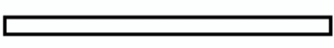

### **Hello! I'm Serena. Welcome to my Github! ˚.⋆**  

CompE Undergraduate • SWE • Learning AI/ML

  

    

### **.get(about_me):**

𑣲 **Education:** CompE @ UA (conc: SWE) & 42 Beirut 
𑣲 **Learning:** AI & DevOps  
𑣲 **Building:** Web, Automations & CV/Classification projects  
𑣲 **Languages:** English, French, Arabic & Japanese
    

    

      
    

  

---

### **.get(tech_stack):**

  
𑣲 <b>Languages</b>

   
  
  
  
  
  

  
𑣲 <b>Frameworks & Libraries</b>

   
  
  
  
  

  
𑣲 <b>Tools</b>

   
  
  
  
  
  
  

  
𑣲 <b>AI/ML</b>

   
  
  
  
  
  

---

### **.get(stats):**

<a href="https://github.com/anuraghazra/github-readme-stats">
  <picture>
    <source media="(prefers-color-scheme: dark)" srcset="https://github-readme-stats.vercel.app/api?username=srnazr&show_icons=true&bg_color=00000000&title_color=ffffff&text_color=ffffff&icon_color=ffffff&border_color=444444">
    <source media="(prefers-color-scheme: light)" srcset="https://github-readme-stats.vercel.app/api?username=srnazr&show_icons=true&bg_color=00000000&title_color=000000&text_color=000000&icon_color=000000&border_color=888888">
    
  </picture>
</a>

---

### **.get(contact_info):**

  

### Get in touch! ♡

[Discord](https://discord.gg/srnaz) · [LinkedIn](https://linkedin.com/in/serenazaarour) · [Email](mailto:serenazaarour@gmail.com)   
<i>Coffee chats & more!</i>

  

  

    
  

  

---

<i>Aaaaaand back to work...</i>

